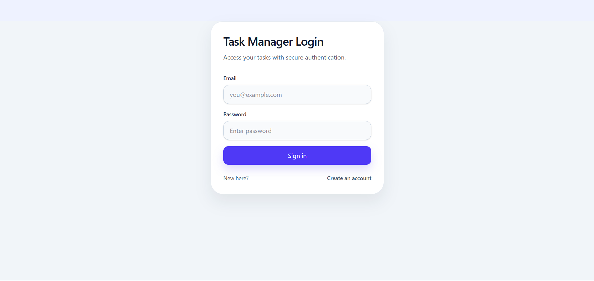
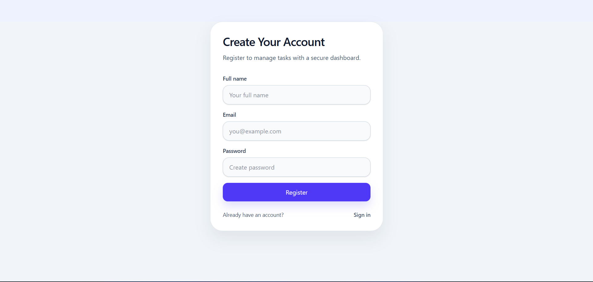
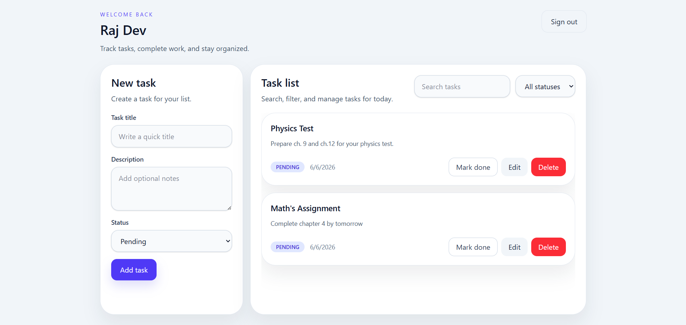

# 🚀 Task Management App

<p align="center">
  
  
  
  
  
  
  
  
  
</p>

A modern **full-stack task management web application** built using the **MERN Stack** for efficient task organization with secure authentication and responsive UI.

---

## 🌐 Live Demo

### Frontend

🔗 **Live App:** `Add Frontend Live Link Here`

### Backend API

🔗 **API Base URL:** `Add Backend Live Link Here`

---

## 📸 Screenshots

### 🔐 Login Page



### 📝 Register Page



### 📋 Dashboard



---

## 🛠️ Tech Stack

### Frontend

* React
* Vite
* Tailwind CSS
* React Router
* Axios

### Backend

* Node.js
* Express.js
* MongoDB
* Mongoose
* JWT Authentication
* bcryptjs

### Tools & Development

* ESLint
* Nodemon
* Git

---

## ✨ Features

### 🔐 Authentication System

* Secure **JWT Authentication**
* User **Registration & Login**
* Password encryption using **bcryptjs**
* Protected routes with authentication middleware
* Persistent login using **localStorage**
* Automatic session handling with Bearer tokens

### 📋 Task Management

* ✅ Create new tasks
* ✏️ Edit existing tasks
* ❌ Delete tasks
* 🔄 Toggle task status (`Pending ↔ Completed`)
* 🔍 Search tasks by title
* 🗂️ Filter tasks by status
* 📄 Pagination support
* ⏱️ Newest-first task sorting

### 🎨 User Experience

* Fully responsive UI
* Mobile-friendly dashboard
* Smooth SPA navigation using React Router
* Protected dashboard access
* Clean and modern Tailwind UI
* Fast performance with **Vite**

### ⚙️ Backend Features

* RESTful API architecture
* MongoDB integration with Mongoose
* Secure middleware-based authentication
* Environment variable support using `.env`
* Health check endpoint
* Proper error handling (404 & server errors)
* User-specific task ownership

---

## 📂 Project Structure

```text
task-management-app/
│── client/
│   ├── public/
│   ├── src/
│   │   ├── pages/
│   │   ├── utils/
│   │   ├── api.js
│   │   ├── App.jsx
│   │   ├── index.css
│   │   └── main.jsx
│   ├── package.json
│   └── vite.config.js
│
│── server/
│   ├── database/
│   ├── middleware/
│   ├── models/
│   ├── routes/
│   ├── .env.example
│   ├── package.json
│   └── server.js
│
├── .gitignore
├── LICENSE
└── README.md
```

---

## ⚡ Installation & Setup

### 1️⃣ Clone the Repository

```bash
git clone https://github.com/Ritik-Gswmi/task-management-app.git
cd task-management-app
```

---

### 2️⃣ Install Backend Dependencies

```bash
cd server
npm install
```

---

### 3️⃣ Install Frontend Dependencies

```bash
cd ../client
npm install
```

---

## 🔑 Environment Variables

Create a `.env` file inside the `server` folder.

```env
MONGO_URI=mongodb://127.0.0.1:27017/task-management-app
JWT_SECRET=your_super_secret_key
PORT=5000
```

### Optional Variables

```env
MONGO_DB_NAME=task-management-app
VITE_API_URL=http://localhost:5000/api
```

---

## ▶️ Running The Application

### Start Backend Server

```bash
cd server
npm run dev
```

Backend runs at:

```text
http://localhost:5000
```

---

### Start Frontend

Open another terminal:

```bash
cd client
npm run dev
```

Frontend runs at:

```text
http://localhost:5173
```

---

## 📡 API Endpoints

### Authentication Routes

| Method | Endpoint             | Description         |
| ------ | -------------------- | ------------------- |
| POST   | `/api/auth/register` | Register a new user |
| POST   | `/api/auth/login`    | Login user          |

### Task Routes

| Method | Endpoint                | Description        |
| ------ | ----------------------- | ------------------ |
| GET    | `/api/tasks`            | Get all tasks      |
| POST   | `/api/tasks`            | Create a task      |
| PUT    | `/api/tasks/:id`        | Update task        |
| PATCH  | `/api/tasks/:id/toggle` | Toggle task status |
| DELETE | `/api/tasks/:id`        | Delete task        |

### Query Parameters

| Parameter | Description                  |
| --------- | ---------------------------- |
| `search`  | Search task by title         |
| `status`  | Filter (`pending/completed`) |
| `page`    | Pagination                   |
| `limit`   | Number of tasks              |

---

## 🧾 Data Models

### User Model

```js
{
  name: String,
  email: String,
  password: String,
  createdAt: Date,
  updatedAt: Date
}
```

### Task Model

```js
{
  title: String,
  description: String,
  status: "pending" | "completed",
  userId: ObjectId,
  createdAt: Date,
  updatedAt: Date
}
```

---

## 💡 Highlights

✔️ JWT Authentication
✔️ Protected Routes
✔️ CRUD Task Management
✔️ Search & Filters
✔️ Pagination Support
✔️ Responsive Design
✔️ Secure Password Hashing
✔️ REST API Architecture

---

## 🤝 Contributing

Contributions are welcome!

1. Fork the project
2. Create your feature branch
3. Commit your changes
4. Push to the branch
5. Open a Pull Request

---

## 📜 License

This project is licensed under the **MIT License**.

---

## 👨‍💻 Author

**Ritik Kumar**
GitHub: `https://github.com/Ritik-Gswmi`
